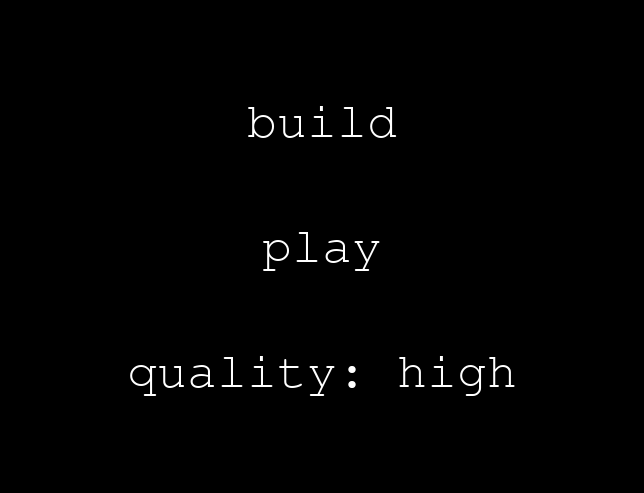
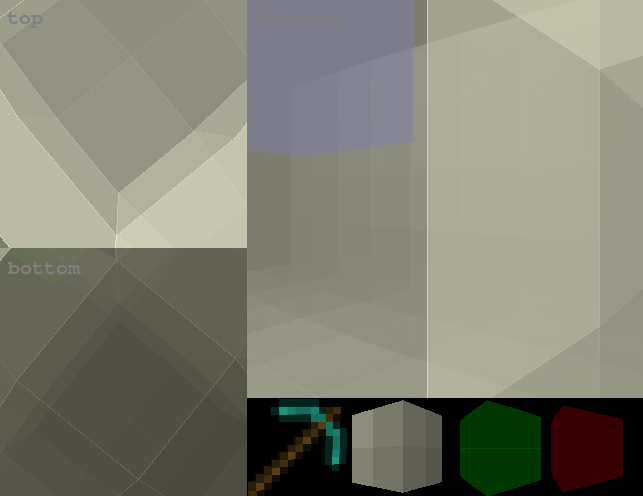
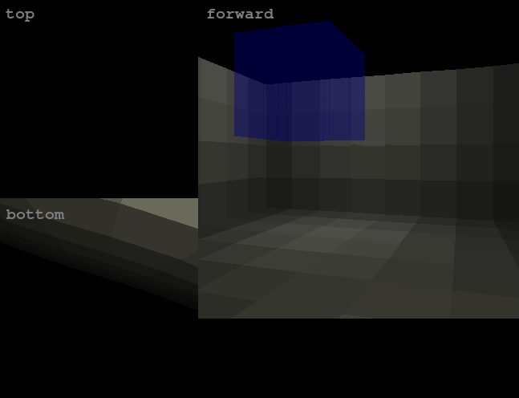

# Maze Minecraft

## Description

This game is a 3D game in which players can build and play mazes. It is roughly based on Minecraft, and the only blocks players can use to build mazes are sandstone-colored regular blocks, green-colored victory zones, and red-colored death zones. In every maze, there is a blue-colored start zone whose position cannot be altered. When playing the maze, players must get to the victory zone while avoiding the death zone.

## Objective

In Build, navigate however you want, pressing keys to move and buttons to mine and place cubes. In Play, play the maze, avoiding the red death zones to reach the green victory zone and win!

## Controls

### Player 1

| Action                            | Button                                  |
| --------------------------------- | --------------------------------------- |
| Move Forward                      | `Z`                                     |
| Move Backward                     | `X`                                     |
| Move Up                           | `W`                                     |
| Move Down                         | `S`                                     |
| Turn Clockwise                    | `Right`                                 |
| Turn Counterclockwise             | `Left`                                  |
| Access Main Menu                  | `Space`                                 |
## Software Used

- [Pygame](https://www.pygame.org/)

## Works Cited

Click [here](WorksCited.md) to go to the Works Cited.

## Flowchart

The flowchart is [here](maze_minecraft_flowchart.pdf).

## Presentation

Click [here](https://docs.google.com/presentation/d/1hF1BDLwrc_pI1aZ9RQuwE0t0a39kWqRPM27NXBxZ610/edit?usp=sharing) to go to the presentation.
